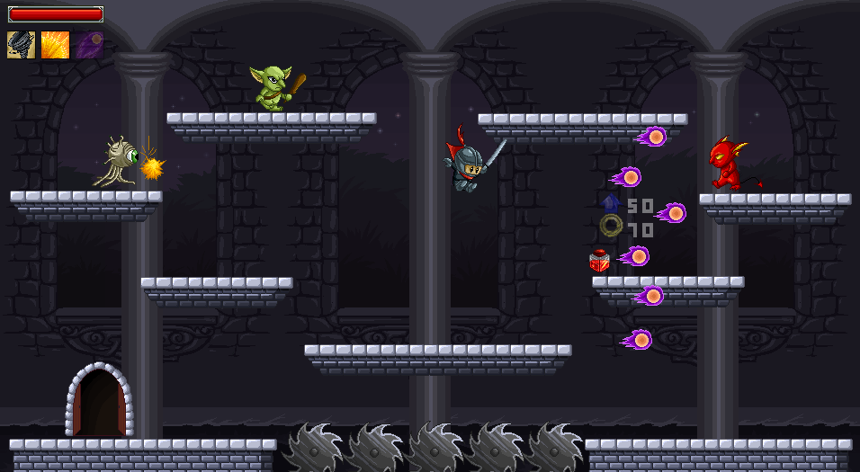

# Magic Castlevania

Team members:\
Jiasheng Zhou \<jiashen2@andrew.cmu.edu\>\
Hao Wang \<haowang2@andrew.cmu.edu\>\
Jianxiang Li \<jianxial@andrew.cmu.edu\>

Project Manager: Jiasheng Zhou \<jiashen2@andrew.cmu.edu\>\
Design Lead: Hao Wang \<haowang2@andrew.cmu.edu\>\
Art Lead: Jianxiang Li \<jianxial@andrew.cmu.edu\>\
Architect: Jiasheng Zhou \<jiashen2@andrew.cmu.edu\>

Tag: 2D platformer, rouge-like, castlevania

Key gameplay idea: \
It’s a rouge-like castlevania game that has 5 levels. Each level has a randomly generated map with several rooms and a BOSS which you need to defeat to get to the next level. You need to collect keys to open the door to the BOSS room. You can find the key and various items like sword and potions scattered in the rooms. Also you can find merchants in the game to buy and sell items.

Theme/plot: \
The dark curtain completely swallows the blue sky on Apr.8th, 2024 due to a total solar eclipse. Jack, an ordinary high school student is walking home after school when he is suddenly hit by a thunderbolt and becomes unconscious.\
“Hey, wake up!”, whispered by a soft voice.\
He wakes up in an unknown castle next to a fairy.\
“Who am I? Where am I?”, said Jack, scratching his head.\
“Thank god you wake up! You are in the castle of Dracula and the sun is covered by the castle! You are the chosen warrior to defeat Dracula and save the world!”, said the fairy.\
…\
After Jack defeats Dracula, the castle doesn’t disappear. However, he feels the strong dark inside him. The fairy shows up and tells him that the true devil is inside his heart and he needs to defeat the devil inside him to save the world and escape the castle..\
Jack goes into the world of his heart and defeats the true devil. Suddenly, the sky becomes blue again and the castle begins to collapse. He wakes up at the desk in his home.\
What a wonderful adventure!

Screen Shot:

Instructions:
Move: AD\
Attack, Drop Item/Equipments: J\
Skill1 - Tornado: K\
Skill2 - Shine: L\
Skill3 - Comet: ;\
Jump, Use item: Space\
Menu selection: Space, WASD\
Open/Enter door: W\
Continue dialog, open shop: E

Sources: 

Sprites: https://craftpix.net/product/fantasy-platformer-game-kit-pixel-art/ \
https://momentaryunicorn.itch.io/momentary-unicorns-evolving-swords \
https://craftpix.net/freebies/free-shield-2d-game-assets-pack/ \
https://www.deviantart.com/tdeleeuw/art/Skyrim-Armour-pixel-art-401280056 \
Font https://www.dafont.com/digital-disco.font \
https://www.1001fonts.com/bulky-pixels-font.html \

This game was built with [NEST](NEST.md).

